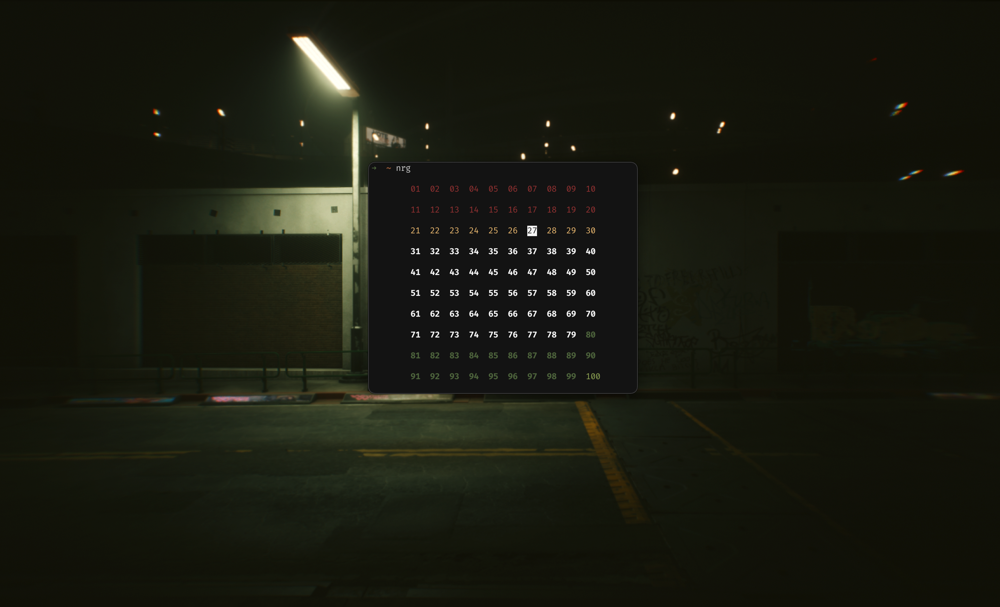

# nrg


nrg is a command-line system information tool written in bash. nrg displays the current battery level in a visually pleasing way.

as of right now, this command-line tool was just a personal thing i wanted, so it only works on macOS, but it should be super portable. if you want to customize the script for your own OS, simply change line 13 to whatever is compatible with your system.
```bash 
bat=$(pmset -g batt | grep -Eo "\d+%" | cut -d% -f1) 
```
 unfortunately, i am terrible at this and do not know how to make a script that would make this globally avaliable on your own system, so what you could do is to clone this project and run:
 ```zsh
 mv nrg /usr/local/bin
 ```
